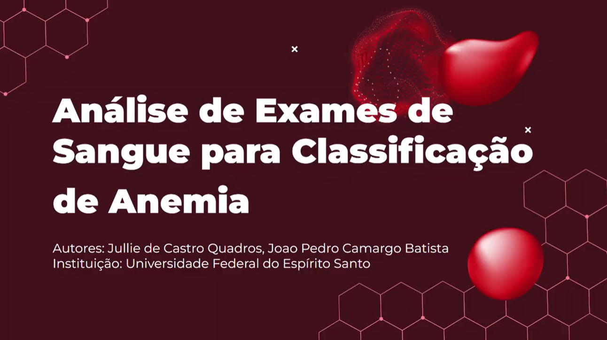
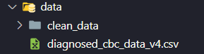
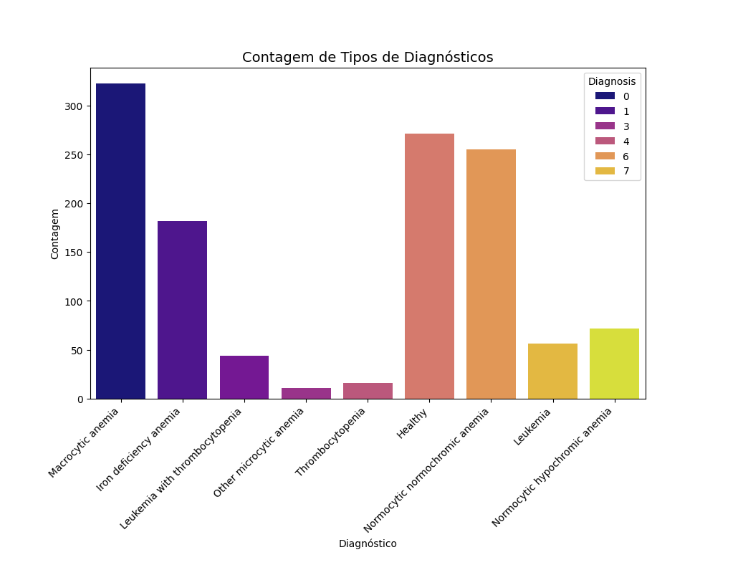
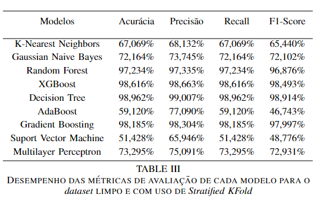
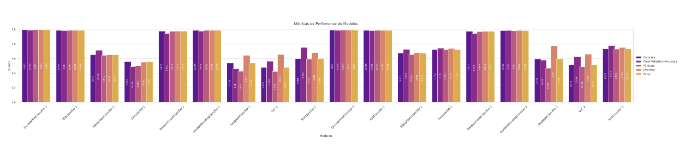
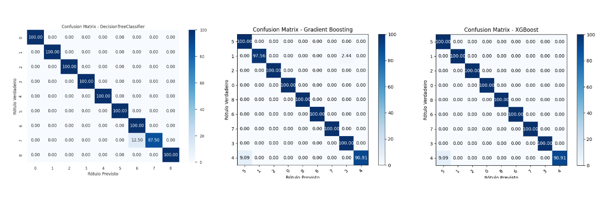
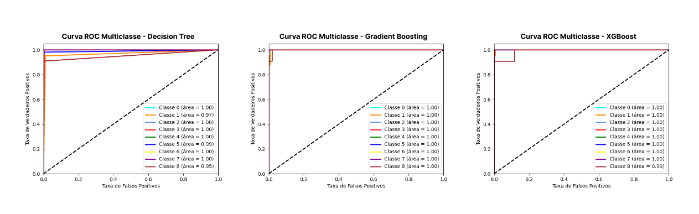

# Análise de Hemogramas e Aplicação de Algoritmos de Machine Learning para Classificação de Anemia


<br>


<p align="center" style="display: flex; align-items: center; justify-content: center;">
  
</p>

## 👀 Overview
Este repositório contém códigos para a análise de parâmetros de hemogramas completos e das diferentes doenças de sangue que podem estar associadas a esses parâmetros. Os códigos fazem uma análise descritiva dos dados, associando a teoria clínica aos valores aferidos na prática. Cada amostra de hemograma está associada a um diagnóstico, que inclui vários tipos de anemia e de outras doenças de sangue que estão associadas à anemia. Os códigos também valem-se de modelos de Machine Learning para prever e classificar os tipo de anemia baseado nos resultados dos exames.

## 👥 Colaboradores
[Jullie Quadros](https://github.com/jcquadros)
<br>
[João Pedro Batista](https://github.com/joaoBatista04)

## 🔗 Tabela de Conteúdos

- [Instalação](#instalação)
- [Descrição dos Dados](#descricao-dos-dados)
- [Uso](#uso)
- [Tecnologias](#tecnologias)
- [Resultados](#resultados)
- [Contribuição](#contribuicao)
- [Agradecimento](#agradecimentos)

## ☁️ Instalação
1. Clone este repositório:
    ```sh
    git clone https://github.com/intel-comp-saude-ufes/2024-1-P1-Anamemia-Types-Classification
    cd 2024-1-P1-Anamemia-Types-Classification

2. Instale as bibliotecas necessárias:
    ```sh
    pip install -r requirements.txt

## 🔢 Descrição dos Dados
Os dados originais encontram-se na pasta `data`, em um arquivo chamado `diagnosed_cbc_data_v4.csv`. 

<p align="center" style="display: flex; align-items: center; justify-content: center;">
  
</p>

Esse arquivo contém o resultado de 1281 hemogramas completos (CBC). Esse exame, popularmente conhecido como exame de sangue, contém alguns parâmetros essenciais, que descrevem a saúde do sangue do paciente. São eles:

- ``Contagem de Hemoglobina (HGB)``
- ``Contagem de Plaquetas (PLT)``
- ``Contagem de Glóbulos Brancos (WBC)``
- ``Contagem de Glóbulos Vermelhos (RBC)``
- ``Volume Celular Médio (MCV)``
- ``Hemoglobina Celular Média (MCH)``
- ``Concentração de Hemoglobina Celular Média (MCHC)``
- ``Distribuição do do Tamanho das Plaquetas (PDW)``
- ``Procalcitonina (PCT)``
- ``Hematócrito (HCT)``
- ``Percentual de Linfócitos (LYMp)``
- ``Percentual de Neutrófilos (NEUTp)``
- ``Número de Linfócitos (LYMn)``
- ``Número de Neutrófilos (NEUTn)``

Além disso, a cada amostra do conjunto de dados (que representa um hemograma completo), está associada um diagnóstico, que pode apontar um tipo de anemia, uma doença de sangue relacionada à anemia ou mesmo que o paciente está saudável. Os possíveis diagnósticos são:

- ``Anemia Macrocítica``
- ``Anemia por Deficiência de Ferro``
- ``Leucemia com Trombocitopenia``
- ``Leucemia``
- ``Trombocitopenia``
- ``Anemia Normocítica Normocrômica``
- ``Anemia Normocítica Hipocrômica``
- ``Outras Anemias Microcíticas``
- ``Saudável``

<p align="center" style="display: flex; align-items: center; justify-content: center;">
  
</p>

## 🛠️ Uso
Para utilizar os códigos e gerar as análises para os dados, basta rodar o arquivo ``main.py``. Você pode fazer isso por meio do comando:

```sh
python3 ./src/main.py
```

Nenhum comando adicional precisa ser realizado e nenhuma flag ou parâmetro precisa ser passado na linha de comando

## 🖥️ Tecnologias
Para o desenvolvimento do projeto, foram utilizadas bibliotecas Python como: ``matplotlib``, ``seaborn``, ``numpy``, ``scikit-learn`` e ``pandas``, entre outras bibliotecas auxiliares.

## 📈 Resultados
Foram utilizados neste projeto 9 diferentes algoritmos de Machine Learning, sendo eles:

- ``KNearest Neighbors``
- ``Gaussian Naive Bayes``
- ``Random Forest``
- ``XGBoost``
- ``Decision Tree``
- ``AdaBoost``
- ``Gradient Boosting``
- ``Suport Vector Machine``
- ``Multilayer Perceptron``

Os resultados dos algoritmos ao serem treinados com o dataset já limpo o com uso de validação cruzada estão sumarizados a seguir:

<p align="center" style="display: flex; align-items: center; justify-content: center;">
  
</p>

Visualmente, os algoritmos alcançaram os seguintes resultados:

<p align="center" style="display: flex; align-items: center; justify-content: center;">
  
</p>

Haja vista que o problema a ser analisado envolve doenças que necessitam de rápido tratamento e identificação acertada, pois há risco de evolução, é necessário escolher um algoritmo que possua uma boa precisão e um alto recall (evitando, assim, falsos negativos). Nesse sentido, os algoritmos com melhor desempenho e que se encaixam no objetivo do problema são:

- ``Decision Tree (98,962% de acurácia)``
- ``XGBoost (98,616% de acurácia)``
- ``Gradient Boosting (98,185% de acurácia)``

As matrizes de confusão após a escolha desses modelos e ajuste de hiperparâmetros, está descrita a seguir: 

<p align="center" style="display: flex; align-items: center; justify-content: center;">
  
</p>

As curvas ROC dos modelos escolhidos também podem ser encontradas a seguir:

<p align="center" style="display: flex; align-items: center; justify-content: center;">
  
</p>

O artigo completo com os resultados do projeto pode ser encontrado [aqui](https://drive.google.com/file/d/1uKoCv6dcJVxAPumVLQ3TidPUdNkJu6LF/view?usp=sharing)

O vídeo de resumo do projeto pode ser encontrado [aqui](https://drive.google.com/file/d/113MYghvv2VaicqA3deQw1mliEeFhBSUE/view?usp=sharing)

## 🤝 Contribuição
Este projeto valoriza a contribuição da comunidade e ficaremos muito felizes com sugestões! Para contribuir, siga as diretrizes abaixo:

1. Fork o Repositório;

2. Crie uma Branch:

```sh 
git checkout -b minha-contribuicao
```
3. Faça um Commit das suas Features:

```sh 
git commit -m "Comment your feature"
```
4. Faça o Push para a Branch:

```sh 
git push origin minha-contribuicao
```
5. Abra um Pull Request.

## 🛐 Agradecimentos
Um agradecimento especial ao professor [André Georghton Pacheco](https://github.com/paaatcha), que permitiu toda a realização do trabalho, dando motivação e assistência para o seu desenvolvimento.